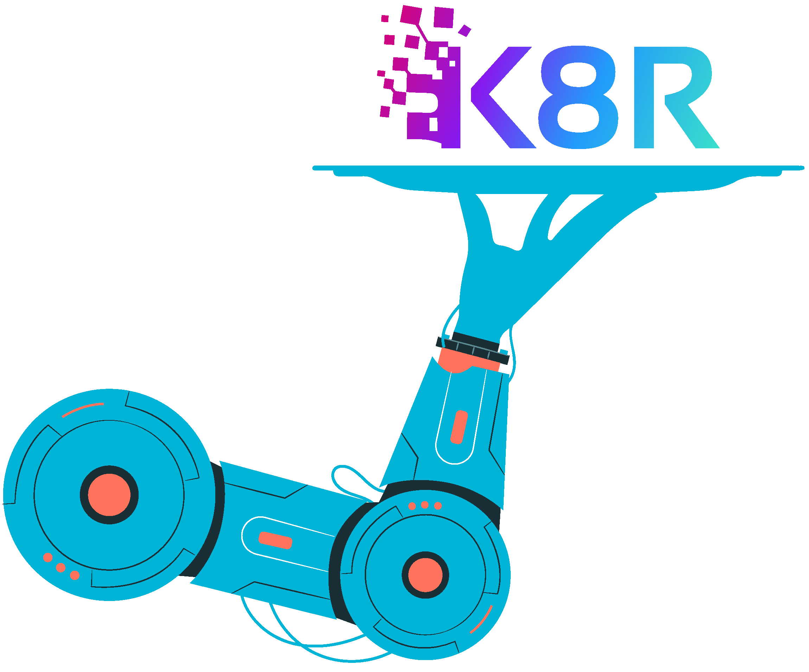

  

  

    An innovative Kubernetes Visualizer providing a catered user experience.
     
  

<!-- TABLE OF CONTENTS -->

  
Table of Contents

  <ol>
    <li>
      <a href="#about-the-project">K8R</a>
      <ul>
        <li><a href="#tech-stack">Tech Stack</a></li>
      </ul>
    </li>
    <li><a href="#installation">Installation</a>
      <ul>
      <li>
        <a href="#getting-started">Getting Started - Initialize a Cluster of Your Choice</a>
          <ul>
            <li>
              <a href="https://github.com/oslabs-beta/k8r/blob/main/documentation/localClusterSetup.md#setup">Initialize a Local Minikube Cluster</a>
            </li>
            <li>
              <a href="https://github.com/oslabs-beta/k8r/blob/main/documentation/cloudClusterSetup.md#initialize-a-cloud-cluster-on-google-cloud-services">Initialize a Cloud Cluster on Google Cloud Services</a>
            </li>
            <li>
              <a href="https://github.com/oslabs-beta/k8r/blob/main/documentation/cloudClusterSetup.md#initialize-a-cloud-cluster-on-amazon-web-services">Initialize a Cloud Cluster on Amazon Web Services</a>
            </li>
          </ul>
      </li>
      <li>
        <a href="#usage">Usage</a>
      </li>
      </ul>
    </li>
        <li>
          <a href="#Contribution">Contribution</a>
        </li>
      </ul>
    </li>
    <li><a href="#extension-settings">Extension Settings</a></li>
    <li><a href="#contributing">Contributing</a></li>
    <li><a href="#license">License</a></li>
    <li><a href="#creators">Creators</a></li>
    <li><a href="#contact">Contact</a></li>
    <li><a href="#acknowledgements">Acknowledgements</a></li>
  </ol>

# Setup
  <ol>
    <li>
      <a href="https://github.com/oslabs-beta/k8r/blob/main/documentation/setup.md#initialize-minikube-cluster---mac-os">Initialize Minikube Cluster</a>
      <ul>
        <li><a href="https://github.com/oslabs-beta/k8r/blob/main/documentation/setup.md#initialize-minikube-cluster---mac-os">Mac OS</a></li>
        <li><a href="https://github.com/oslabs-beta/k8r/blob/main/documentation/setup.md#initialize-minikube-cluster---windows">Windows</a></li>
      </ul>
    </li>
    <li><a href="https://github.com/oslabs-beta/k8r/blob/main/documentation/setup.md#edit-grafana-config-map">Edit Grafana Config Map</a></li>
    <li><a href="https://github.com/oslabs-beta/k8r/blob/main/documentation/setup.md#expose-port-and-access-grafana">Expose Port and Access Grafana</a></li>
  </ol>

# Tech Stack

 
 

 

 

## Contribution
Contributions are a great way to contribute to the open source community as a whole. If you'd like to contribute to K8R, please follow the steps below to get started.

1. Fork the Project
2. Create your Feature Branch (`git checkout -b feature/yourNewFeature`)
3. Commit your Changes (`git commit -m 'Add some a fantastic new feature'`)
4. Push to the Branch (`git push origin feature/yourNewFeature`)
5. Open a Pull Request

## License
Distributed under the MIT License. See [`LICENSE`](https://github.com/oslabs-beta/k8r/blob/master/LICENSE) for more information.

## Creators
| Developed By |    |    |
| :---:   | :---: | :---: |
| Josh Howard  |    |    |
| Brian Jaber  |    |    |
| Anthony Cho  |    |    |
| Chris Oakes  |    |    |